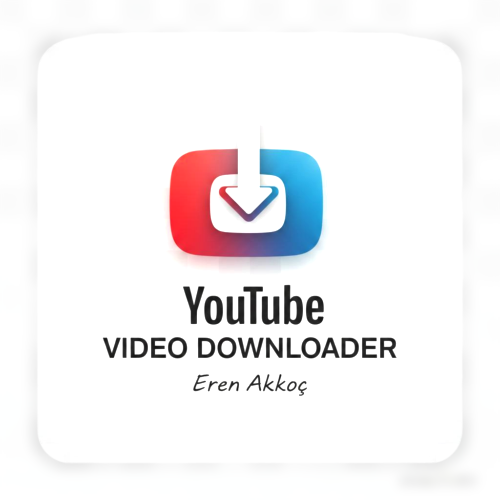

# YouTube Video Downloader



YouTube Video Downloader, YouTube videolarını farklı kalite seçenekleriyle kolayca indirmenizi sağlayan modern ve çok platformlu bir uygulamadır.

[](https://github.com/ernakkc/youtube_download_manager/releases/tag/v1.0.0)
[](https://opensource.org/licenses/MIT)

---

## 🚀 Hızlı Erişim - Release v1.0.0

| Platform  | İndirme Linki |
|-----------|---------------|
| **Android APK**  | [📥 İndir](https://github.com/ernakkc/youtube_download_manager/releases/download/v1.0.0/youtube_download_manager_android.zip) |
| **Android AAB**  | [📥 İndir](https://github.com/ernakkc/youtube_download_manager/releases/download/v1.0.0/youtube_download_manager_android_aab.zip) |
| **macOS**        | [📥 İndir](https://github.com/ernakkc/youtube_download_manager/releases/download/v1.0.0/youtube_download_manager_macos.zip) |
| **Web**          | [📥 İndir](https://github.com/ernakkc/youtube_download_manager/releases/download/v1.0.0/youtube_download_manager_web.zip) |

> **Not:** Windows ve Linux için derleme işlemi sadece ilgili işletim sistemlerinde yapılabilir. iOS için Xcode ile imzalayarak yükleyin.

---

## Özellikler
- 🔍 **Gerçek YouTube Arama**: YouTube API'si ile arama yapın
- 📹 **Çoklu Kalite Seçenekleri**: 1080p, 720p, 480p gibi farklı çözünürlüklerde indirme
- 📊 **İlerleme Takibi**: İndirme sürecini gerçek zamanlı izleyin
- ⏸️ **İptal Etme**: İndirme işlemini istediğiniz zaman durdurun
- 🔄 **Arka Plan İndirme**: Uygulama kapanmış olsa bile indirme devam eder
- 📚 **Kütüphane Yönetimi**: İndirilen videoları görüntüleyin ve açın
- 🎨 **Modern UI**: Kullanıcı dostu ve şık arayüz

## Kurulum Talimatları

### Android
1. Yukarıdaki APK linkinden zip dosyasını indirin ve çıkarın.
2. `.apk` dosyasını Android cihazınıza aktarın.
3. Cihaz ayarlarından "Bilinmeyen kaynaklardan yüklemeye izin verin".
4. Dosyayı açarak yükleyin.

### Android (Google Play için)
- AAB dosyasını Google Play Console'a yükleyin.

### macOS
1. Yukarıdaki macOS linkinden zip dosyasını indirin ve çıkarın.
2. `.app` dosyasını Applications klasörüne taşıyın.
3. İlk açışınızda güvenlik uyarısı alabilirsiniz, Sistem Tercihleri > Güvenlik ve Gizlilik'ten izin verin.

### Web
1. Yukarıdaki Web linkinden zip dosyasını indirin ve çıkarın.
2. `index.html` dosyasını bir web tarayıcısında açın veya web sunucusuna yükleyin.

### iOS
- Xcode ile projeyi açın ve `flutter build ios --release` komutuyla derleyin.
- Apple Developer hesabınızla imzalayarak yükleyin.

## Geliştirme

Bu proje Flutter ile geliştirilmiştir.

### Gereksinimler
- Flutter SDK (3.0+)
- Dart SDK
- Android Studio (Android için)
- Xcode (macOS/iOS için)

### Çalıştırma
```bash
flutter pub get
flutter run
```

### Derleme
```bash
# Android APK
flutter build apk --release

# Android AAB
flutter build appbundle --release

# macOS
flutter build macos --release

# Web
flutter build web --release
```

## Lisans
Bu proje MIT lisansı altında lisanslanmıştır. Detaylar için [LICENSE](LICENSE) dosyasına bakın.

---

> Geliştirici: [Eren Akkoç](https://erenakkoc.com)  
> GitHub: [@ernakkc](https://github.com/ernakkc)
